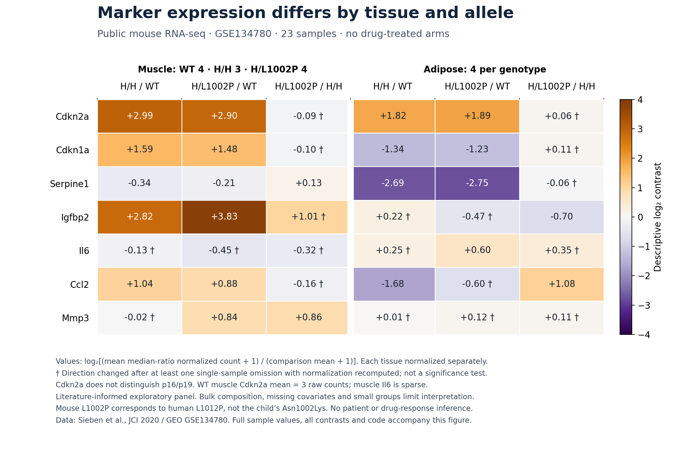

# Testing selective cell clearance in BUB1B-related MVA

Track 2 · Rare Disease, Real Kid: The MVA Hackathon 2026  
Himanshu Kumar (@HIMANSHUKUMARJHA) · Research update, 11 September 2026

## 1. Proposed decision

We nominate **dasatinib alone for preclinical repurposing research**. Quercetin and D+Q are not nominated candidates; their published results are indirect background evidence. The organizer clarification limits proposed combinations to market-approved medicines. [Organizer response](https://huggingface.co/spaces/SageBio/rare-disease-real-kid-mva-hackathon-2026/discussions/5). The question is whether selective removal of persistent senescent cells can improve tissue function associated with BUB1B dysfunction at a feasible exposure, while preserving developing and repair-capable cells. This proposal does not recommend treatment of the child.

The rationale separates dasatinib-only cell experiments, genetic clearance in a same-gene mouse model, and indirect D+Q findings from patents and other diseases. Combination results cannot establish dasatinib-only benefit. None measures the child's target burden or drug response. Our contribution is a transparent assessment of these evidence gaps, an exploratory audit of public mouse expression data, and a staged comparison that can reject the candidate as readily as advance it.

The first decision is whether the disease model supports clearance or preservation of impaired cells. Dasatinib has no established experimental priority over preservation candidates. We add sodium phenylbutyrate as a separate comparison if protein stress is demonstrated; advancement of either strategy requires net functional benefit.

### Contribution and decision

**The claim to test:** In a BUB1B disease model with a verified persistent senescence burden, dasatinib alone improves total tissue function through selective clearance at an exposure that preserves neural function and does not worsen chromosome-segregation errors in surviving cells. Every condition matters; fewer positive markers alone cannot satisfy the claim.

| Contribution | Completed evidence | What remains proposed |
|---|---|---|
| Case-linked rationale | Organizer-validated gene/variant recovery, with unblinded development disclosed | Phase, allele function and disease-model confirmation |
| Reproducible analysis | Public mouse expression audit with complete marker results and sensitivity checks | Drug-response prediction or biological validation |
| Candidate assessment | Separation of single-agent, combination and genetic findings; adverse evidence and prior art retained | Direct dasatinib benefit in MVA |
| Research decision | Defined clearance-versus-preservation comparison and reasons to reject the lead | Functional experiments, justified exposure and independent replication |

The contribution is this case-linked evidence assessment and falsifiable research decision. We do not claim to have discovered senolysis or to have established a first-in-field method. A negative result can prevent advancement of an unsuitable candidate, but its value depends on adequate model, exposure and endpoint validation.

## 2. Genetic mechanism and model relevance

Track 1 recovered the organizer-validated BUB1B pair, p.Leu737Ter and p.Asn1002Lys. The original analysis checked known disease genes first; subsequent ranking and 162 sensitivity settings tested stability within this case. The perfect organizer score is not independent validation of our development process. Our work has not established trans phase or experimentally characterized either allele. A subsequent [offline transcript-selection audit](local_ranking_audit/README.md) exactly reproduced the 194-entry baseline and recovered 20 omitted variant–gene entries; the BUB1B pair remained at ranks 1 and 3 across six local branches. This is additional same-case method checking, not independent diagnostic or drug-response validation. Updated [Track 1 methods](HIMANSHUKUMARJHA_track1_report.md) preserve the original development history.

p.Leu737Ter is predicted to cause loss of function, potentially through nonsense-mediated decay. p.Asn1002Lys has damaging computational predictions, but residual protein activity is unknown. BUBR1, BUB3, MAD2 and CDC20 form the mitotic checkpoint complex that restrains APC/C. Defective checkpoint and chromosome-attachment functions can contribute to missegregation; downstream persistent senescence is a hypothesis to test separately. [Lischetti et al., 2014](https://www.nature.com/articles/ncomms6563).

Baker's genetic clearance experiment delayed selected muscle, fat and lens deficits in BubR1 hypomorphic mice, while cardiac arrhythmias and arterial stiffening were not attenuated, and overall survival was not substantially extended. Established cataracts did not reverse with late treatment. This supports a restricted tissue hypothesis, not reversal of congenital MVA features. [Baker et al., 2011](https://doi.org/10.1038/nature10600).

The allele matters beyond total protein abundance. Sieben and colleagues observed different tissue phenotypes and secretory signatures between H/H and H/L1002P mice despite similar overall BUBR1 levels and broadly similar aneuploidy across surveyed tissues; splenocyte rates differed. Their mouse L1002P allele corresponds to human L1012P; it is **not** the child's p.Asn1002Lys. [Sieben et al., 2020](https://www.jci.org/articles/view/126863).

## 3. What the drug evidence establishes

### Precedent and mechanism

Dasatinib alone preferentially reduced viability in senescent human preadipocytes and was substantially less active in senescent endothelial cells. This is a cell-specific in-vitro result, not an MVA functional outcome. The original Figure 2A used ATP-based viability measurements; the combination experiments should not be relabeled as single-drug apoptosis evidence. [Zhu et al., 2015](https://doi.org/10.1111/acel.12344). It justifies testing a relevant susceptible cell state, not assuming that all senescent cells respond.

A separate dasatinib-only study of commercially sourced human bone-marrow MSCs reported fewer senescence-positive cells after serial passage and treatment, with mixed differentiation results. Mineralization normalized to DNA decreased in one donor; chondrogenic findings were inconclusive. The reported reduction in live cells per field is not itself proof of selective senescent-cell death. Technical triplicates are not independent donors, and nonsignificant IDO differences do not establish preserved immune function. This adds non-MVA single-agent evidence but does not demonstrate tissue rescue or a safe exposure for the child. [Heinrichs et al., 2024](https://doi.org/10.1007/s12195-024-00830-1).

D+Q in BubR1-deficient mice is prior work. Example 11 of patent WO2015116735A1 reports lower adipose senescence-associated markers in eight-month-old female BubR1 H/H mice. The p16 transcript change versus pretreatment baseline had P=.07; sample size and functional rescue were not reported there. We treat this as patent-reported evidence requiring independent validation. [Patent, published 2015](https://patents.google.com/patent/WO2015116735A1/en).

The peer-reviewed discovery paper found different sensitivities across senescent cell types; its progeroid functional experiments used Ercc1-deficient mice. Those results must not be relabeled as BubR1 pharmacologic rescue. [Zhu et al., 2015](https://doi.org/10.1111/acel.12344). D+Q also changes immune/metabolic states in aged mice, reinforcing the need to measure cell fate directly rather than equating every expression change with clearance. [Hou et al., 2026](https://www.nature.com/articles/s43587-026-01130-1), abstract and accessible extended data; main text access was limited.

### Adult D+Q studies: indirect combination evidence

| Study and design | Main observation relevant to this proposal | Interpretation |
|---|---|---|
| [Hickson 2019](https://pubmed.ncbi.nlm.nih.gov/31542391/): open-label, 9 adults with diabetic kidney disease | Peripheral senescence-associated markers fell after a short course | Preliminary target-engagement evidence; not demonstrated kidney or MVA benefit |
| [Justice 2019](https://pubmed.ncbi.nlm.nih.gov/30616998/): open-label, 14 adults with pulmonary fibrosis | Feasibility and exploratory physical-function signals; pulmonary function did not improve | Uncontrolled efficacy signals; one serious event occurred after treatment, without establishing causality |
| [Nambiar 2023](https://pmc.ncbi.nlm.nih.gov/articles/PMC10006434/): single-blind randomized placebo pilot, 6 per arm | 65 versus 22 nonserious adverse events; no statistically significant between-group exploratory functional difference detected | Small feasibility study, not a powered efficacy test; event counts are not participant counts |
| [Farr 2024](https://www.nature.com/articles/s41591-024-03096-2): open-label randomized, 60 postmenopausal women, no-treatment control | Primary 20-week bone-resorption endpoint not different, P=.611 | High-p16 subgroup findings remain exploratory |
| [STAMINA, Millar 2025](https://pubmed.ncbi.nlm.nih.gov/40010154/): single-arm, 12 older adults | Overall cognition and TNF-alpha changes were not statistically significant | Further feasibility evidence without an efficacy upgrade |
| [TRUTH, Koning et al. 2026](https://www.easlcongress.eu/wp-content/uploads/2026/05/EASL_2026-Abstract_version-2-1.pdf#page=25): double-blind randomized placebo trial, 31 adults with fibrotic MASH | Fibrosis improvement without worsening MASH: 8/17 versus 1/14, reported P=.041; adverse events in 14/17 versus 6/14 | Positive disease-specific histologic result, currently verified as congress abstract LBO-005-YI; full trial paper not verified |

These human studies used D+Q; they do not establish the efficacy of dasatinib alone. Their findings are mixed and disease-specific. The positive MASH result deserves inclusion alongside the negative bone endpoint, with its preliminary publication status visible. Neither establishes MVA efficacy, and histologic improvement alone does not prove that selective clearance caused it. We do not pool these heterogeneous studies or translate their adult regimens into a pediatric dose.

### Additional animal evidence: benefit and mechanism remain distinct

A 2026 diabetic-mouse study reported lower plasma creatinine and less kidney injury after D+Q, without improved glucose control. It tested the combination in a non-MVA model and did not isolate either component. [Bian et al., 2026](https://doi.org/10.1016/j.ebiom.2026.106124). Another study found improved disc morphology and cell retention in SM/J mice; the authors proposed that D+Q could act through cell preservation rather than only selective killing. This supplies a competing interpretation of a favorable outcome, not proof of its mechanism or dasatinib-only efficacy. [Novais et al., 2026](https://doi.org/10.1038/s41413-026-00526-4). Neither closes the MVA intervention gap.

### Neural function and exposure

A separate non-MVA fibroblast study reported reduced cell-cycle transcripts, including BUB1B, with dasatinib. Its growth arrest was reversible after washout, without increased cell death in the tested conditions. This does not establish MVA injury or functional checkpoint inhibition, but it adds a reason to measure residual BUBR1/checkpoint activity when surviving cells resume division. Marker reduction alone cannot distinguish clearance from altered proliferation. [Haubeiss et al., 2010](https://doi.org/10.1186/1476-4598-9-168), including supplementary Table S2. This paragraph reports the published experiment, not a new biological result.

Lombardo et al. reported myelin and oligodendrocyte dysfunction in young-adult/aged mice and rat cultures without detected cell death. The mouse exposure was intermittent, and each component also caused process retraction in culture. Survival, component removal and intermittent administration therefore cannot be assumed to solve the neural concern. These results do not estimate human risk. [Lombardo et al., 2026](https://pubmed.ncbi.nlm.nih.gov/41843680/). The nominal dasatinib concentration used in the oligodendrocyte experiment overlaps concentrations studied for senolytic activity by Zhu. Different cell types, media and exposure durations prevent a therapeutic-window calculation. Matched activity and neural-function measurements at justified unbound exposures are still needed.

Exposure must be measured in the relevant compartment. In a five-person Alzheimer feasibility study, dasatinib was detected in CSF in four participants and quercetin was not detected. That does not establish neural target engagement or a safe exposure for MVA. [Gonzales et al., 2023](https://www.nature.com/articles/s41591-023-02543-w). Quercetin formulation also changes absorption; a phytosome and an unformulated product are not interchangeable. [Riva et al., 2019](https://doi.org/10.1007/s13318-018-0517-3).

## 4. Exploratory public-data audit

We completed a descriptive reanalysis of [GSE134780](https://www.ncbi.nlm.nih.gov/geo/query/acc.cgi?acc=GSE134780): 24,062 gene rows and 23 mouse samples. Muscle groups contained 4 WT, 3 H/H and 4 H/L1002P samples; adipose groups had 4 each. The seven-marker panel was selected from the literature before full-count download, after the paper and metadata were read. This was unblinded, exploratory analysis.

All seven markers are reported. Cdkn2a was higher in both mutant groups in both tissues; Cdkn1a was higher in mutant muscle but lower in mutant fat, and Serpine1 was lower in both. The gene-level Cdkn2a measure does not distinguish p16 from p19; its WT muscle mean was only three raw counts. Muscle Il6 was also sparse. These are expression patterns, not counts of senescent cells or proof of their biological role.

Directions agreed between median-ratio and total-count normalization in 41/42 comparisons; the discordant effect was near zero. Only 23/42 retained their direction across every single-sample omission with normalization recomputed. The full [audit](public_mouse_audit/findings.md) reports all effects, individual sample values and sensitivity results, with code and input hashes. Omission fractions are not probabilities or confidence intervals; no p-values or pathway-wide enrichment claims were calculated.

There are no drug-treated or neural samples. Sample-specific sex, exact age, batch/litter and tissue pairing are unavailable in the metadata. Bulk composition and survivor selection can influence expression. The result justifies checking tissue-specific target biology and avoiding a single-marker claim; it does not validate D+Q, this child's allele pair or a clinical response.

### Independent heart-data check

A fixed-panel audit of the public GSE277997 author-results table found all seven marker estimates higher in hypomorphic hearts; Cdkn2a, Cdkn1a and Igfbp2 had reported adjusted P below .05. Directions agreed with four of seven markers in each earlier muscle/fat comparison. This is partial cross-study corroboration, not drug-response validation: ages and methods differ, bulk composition can confound results, and no independent sex adjustment was possible without sample counts. The [reproducible audit](heart_evidence_audit/README.md) reports every marker and preserves the authors' statistics. [Heart study](https://doi.org/10.1111/acel.70160).

## 5. Candidate comparison

Dasatinib remains the approved medicine nominated for the clearance hypothesis. A testable rationale does not establish superiority or automatic priority. Select the experimental branch from the measured phenotype: persistent harmful senescence, impaired protein handling/differentiation, or an upstream checkpoint defect.

| Candidate or control | Purpose | Current disposition |
|---|---|---|
| Dasatinib alone versus vehicle | Measure the nominated approved medicine's activity and harm | Primary pharmacologic comparison |
| Published quercetin / D+Q findings | Assess indirect precedent, limitations and adverse findings | Background only; not a nominated drug or combination |
| Sodium phenylbutyrate | Test preservation when protein stress is present | Named comparison; requires functional, exposure and metabolite-safety evidence |
| Metformin | Examine oligodendrocyte differentiation/myelination | Separate comparison only if the model shows the relevant deficit |
| Genotype correction / BUBR1 complementation | Test whether the phenotype tracks the disease mechanism | Mechanistic control, not a repurposed medicine |
| SIRT2/BubR1 stabilization | Upstream mechanism in published models | Research reference; no verified approved drug rescue of these alleles |
| Navitoclax or fisetin | Alternative senolytic research mechanisms | Not nominated as market-approved MVA candidates |

Sodium phenylbutyrate reduced aggregate and apoptosis readouts in human trisomy 21/13 iPSC-derived neurons when exposure began during neural induction. This was a prevention experiment, not recovery of established neuronal dysfunction; electrophysiological benefit was not demonstrated. [Hirata et al., 2020](https://www.nature.com/articles/s41598-020-70362-x). Earlier human trisomy fibroblast work also addressed prevention of senescence. [Nawa et al., 2019](https://doi.org/10.1371/journal.pone.0219592). Constitutive trisomy does not reproduce ongoing BUB1B-related chromosome instability. Sodium phenylbutyrate is approved for urea-cycle disorders; its phenylacetate metabolite has a neurotoxicity warning. Parent drug, metabolite, neural function and sustained exposure need separate assessment. [PHEBURANE label, July 2026](https://dailymed.nlm.nih.gov/dailymed/fda/fdaDrugXsl.cfm?setid=d15f2cbf-4d22-40b5-8ef9-16b9d323a7f9).

Metformin improved myelin-related outcomes in human stem-cell-derived oligodendrocytes and a myelin-deficient mouse chimera model. This is neither MVA evidence nor a reason to add it to D+Q as another drug. [Kazakou et al., 2025](https://www.nature.com/articles/s41467-025-63279-4). Its diabetes approval and renal/lactic-acidosis precautions require a separate pharmacology assessment; familiarity does not establish suitability here. [Metformin labeling](https://dailymed.nlm.nih.gov/dailymed/lookup.cfm?setid=f39ee08d-73db-71b9-e053-2995a90a877c).

Wild-type BUB1B complementation improved checkpoint responses in other MVA patient-derived, SV40-transformed fibroblast lines. This supports a correction/complementation control with explicit model limits. [Suijkerbuijk 2010](https://pubmed.ncbi.nlm.nih.gov/20516114/). Genetic SIRT2 overexpression extended survival in hypomorphic mice; a separate NMN experiment measured BubR1 abundance in aged wild-type testes. The latter did not demonstrate MVA functional rescue or survival extension. [North 2014](https://pmc.ncbi.nlm.nih.gov/articles/PMC4194088/). Protein abundance, residual activity and ongoing chromosome segregation must be measured separately.

A 2026 Drosophila study of neural bub3/rod depletion provides a competing preservation mechanism: genetic mitochondrial chaperone or ROS-handling interventions restored brain size with partial neuroblast recovery. Recovered Supplementary Figure 6C data show that rapamycin increased mean neuroblast counts by 20.6% but reduced mean brain-lobe area by 21.3%. These are descriptive published-data comparisons with unverified animal-level independence, not uncomplicated functional rescue. Genetic autophagy enhancement also did not restore brain size. This supports measuring mitochondrial/proteostasis impairment and tissue function; it does not establish a drug response for the submitted BUB1B alleles. [González-Blanco et al., 2026](https://www.nature.com/articles/s41467-026-70521-0). The [patient-benefit review](patient_benefit_review.md) evaluates this branch, exact DNA-variant matching, human evidence and approved mitochondrial/redox alternatives.

A conference abstract reports AZD1152-associated survival improvement in BubR1 hypomorphic mice, without broader phenotypic recovery. This is limited direct pharmacological precedent, not dasatinib evidence; full-publication confirmation and market approval were not verified. It is not nominated. [Hurley et al., ASCPT 2013, LBII-2, p. 92](https://www.ascpt.org/Portals/28/docs/Annual%20Meetings/Annual%20Meeting%20Archive/2013%20Final%20Program.pdf).

## 6. The next decisive experiment

The proposed outcome is **functional benefit with selective activity at a feasible exposure**. A reduction in a marker is insufficient. The companion [research plan](research_plan.md) specifies the comparison, reporting units and decisions.

1. **Establish the model and baseline target.** Confirm phase/allele function through authorized research channels. Compare a disease-background model, independently verified corrected/complemented controls and unrelated controls. Record passage, population doublings, oxygen and differentiation history. Measure persistent arrest and complementary senescence readouts, with nonsenescent quiescent and differentiated controls. Reprogramming can reset aspects of senescence; a derived pluripotent model cannot be assumed to preserve the donor cell's baseline state. [Lapasset et al., 2011](https://pubmed.ncbi.nlm.nih.gov/22056670/).
2. **Define the exposure window before claiming efficacy.** Record product/chemical form, measured medium concentration and stability, protein binding/free-exposure assumptions, metabolites and washout. Compare target activity and neural differentiation/function across matched concentration-time conditions, with measured or explicitly justified unbound exposure. Require separation between useful activity and functional harm; total plasma peaks and preserved viability cannot establish it. A positive result requiring implausible tissue exposure does not support translation. This is an experimental feasibility assessment, not pediatric dose selection.
3. **Compare vehicle with dasatinib alone when the clearance target is present.** Add a separately justified preservation comparison, including delayed treatment after a deficit is established. Count the absolute numbers and fates of senescent and non-senescent cells, then measure tissue function after exposure and washout. A candidate functional endpoint is contractile output in a validated muscle model; neural evaluation requires differentiation, process/myelin measures and, where feasible, functional support of axons. Report total tissue/construct output as well as output per surviving cell, so enrichment cannot conceal loss of net function. Model suitability and endpoint feasibility remain to be established.
4. **Distinguish clearance from repair and selection.** Report chromosome-segregation errors per observed division in survivors, alongside cell yield and aneuploid fractions. Selectively losing aneuploid cells can improve a proportion while leaving the checkpoint defect unchanged. Follow recurrent target burden and tissue function after washout. Where feasible, use an orthogonal selective-clearance comparison to test whether removal mediates functional benefit. Otherwise, concurrent clearance and improvement remain an association; genotype correction alone does not establish mediation. Deleting p16 is not an interchangeable clearance control.
5. **Require preservation of healthy function.** Neural dysfunction, impaired growth/repair, marrow injury or adverse cancer-context effects block advancement at the tested exposure. Dasatinib labeling identifies marrow, bleeding, fluid-retention, cardiopulmonary and pediatric growth concerns. [FDA label](https://www.accessdata.fda.gov/drugsatfda_docs/label/2024/021986s028lbl.pdf). Transient senescent cells can support wound repair, so indiscriminate removal is not the objective. [Demaria et al., 2014](https://doi.org/10.1016/j.devcel.2014.11.012).

Stop this mechanism in the tested model if target burden is absent, killing is nonspecific, tissue function does not improve, or harm exceeds a prespecified margin. A benefit from dasatinib without demonstrated selective clearance would leave the clearance mechanism unproven; evaluate the observed preservation mechanism separately. No synergy claim is made. A nonsignificant harm test is not proof of safety.

Before confirmatory experiments, a qualified laboratory team must set the primary functional endpoint, meaningful effect/harm margins, biological unit, sample size from feasibility variance, exposure schedule, exclusions and multiplicity handling. Randomize within batches, blind outcome scoring and aggregate technical wells within independent units. These decisions remain pending: this is a research proposal, not a registered or powered protocol. No new cell, animal or patient experiment was performed by our team.

## 7. Value, feasibility and limits

A useful result would identify a specific tissue and cell state in which the approved drug has selective functional benefit, or provide a well-controlled reason to reject it. The code, source ledger and explicit failures can be reused without sharing the child's genome. The immediate deliverables are reproducible computational work and an experimental decision plan; patient material, laboratory partners, experimental budget and timelines are not secured.

The main uncertainties are allele phase/function, baseline target burden, model relevance, drug selectivity, achievable exposure and pediatric MVA safety/benefit. Neither a perfect Track 1 score nor a public mouse transcript pattern resolves them. We make no first-discovery claim: D+Q and the same-gene patent precedent predate this submission. Biological transfer to other MVA genes or patients requires separate evidence.

## 8. Methods and data handling

**Team:** Himanshu Kumar. **Approach:** Targeted literature review and AI-assisted curation linking the Track 1 findings to genetic, pharmacologic and clinical evidence. We inspected contrary findings and prior art, compared alternatives by the question they answer, and performed a descriptive public-data audit. No validated automated drug-discovery model or clinical adjudication was used.

**Search scope:** The 11 September follow-up checked additional 2026 publications and organizer clarification on combinations. Public primary papers, trial reports/registries, regulator labeling, the original patent and the official congress abstract. Searches on 7–8 September covered BUB1B/BubR1 models, allele-specific rescue, senolysis, controlled D+Q results, neural harm, exposure/formulation and competing mechanisms. The [source ledger](evidence_ledger.json) records evidence type and limits; the [search log](search_log.md) records scope and exclusions. This was targeted research, not a systematic review or proof that no other treatment exists.

**Reproducibility:** Track 1 scripts retain their original disclosure of unblinded development and within-case sensitivity. The public mouse audit includes source URLs, input hashes, sample mapping, code, normalization sensitivity and complete panel results. It is exploratory and literature-informed, with no claim of blinded validation. Biological follow-up is proposed work.

**Resources:** Analysis runs locally using public reference resources and GEO counts. AI subscriptions are separate expenses. Experimental material, laboratory access, clinical expertise and a wet-laboratory budget are not secured; a numerical cost or completion schedule would be speculative.

**AI and data-handling disclosure:**

**Anthropic:** Claude Opus 5 (`claude-opus-5` in the session record), through Claude Code on the participant-reported Claude Pro subscription. The assistant helped implement the original pipeline, interpret outputs, search literature and draft reports. Local tool results supplied candidate-variant information and HPO terms to its context. The previous statement that no genomic or clinical information reached a commercial AI provider was incorrect.

**OpenAI:** Codex assisted with the 7–11 September review, source checks, code corrections, tests, sensitivity analysis, public mouse-data analysis and revised writing. Separate Codex research agents reviewed distinct evidence questions; their outputs were reconciled and checked against sources. Its context included the reports, candidate findings and selected tool outputs. AI output is not biological evidence. The participant confirmed on 7 September that Codex uses the Pro plan with model training disabled. On 11 September, the participant identified the current model as Astra and the current plan as “Pro20x”; those labels are recorded as reported, without an independent billing or model-history audit. The participant also confirmed that Claude training was disabled during the original work. These account settings are participant-reported; this revision does not claim an independent audit of historical provider retention.

**Ensembl:** The original workflow sent variant coordinates and alleles to the public VEP REST API for annotation and queried reference bases through the sequence API. The September revision reused the existing annotation cache; it did not re-send the genome-wide coding set.

**Deepgram:** Earlier pitch versions used Aura 2 (`aura-2-thalia-en`) for synthesis and Nova 3 for vocabulary checks. The final revised cut is silent at the participant’s request; no new external speech request was made for this cut. The revised scripts include `mip_opt_out=true` in both requests. Deepgram documents that opted-out data is retained only to process the request. Earlier scripts omitted that per-request parameter; the account-level treatment of those earlier requests has not been independently established. The material sent for the pitch consists of report findings and general scientific reasoning, rather than a genome-wide genotype table. [Deepgram documentation](https://developers.deepgram.com/docs/the-deepgram-model-improvement-partnership-program).

The organizers distinguish qualifying processors from recipients and allow the report, candidate findings and HPO terms to remain available. We retain local genomic inputs, intermediate tables and annotation caches only for the permitted period, and will delete those materials and relevant local log content within 30 days of hackathon close, confirming deletion to the organizers. The repository excludes the child’s raw and genome-scale derived data. The additional expression analysis uses unrelated, publicly released mouse counts from GEO; these are not the challenge dataset. This disclosure describes the workflow; it does not assert that an unverified service setting has been audited. [Organizer clarification](https://huggingface.co/spaces/SageBio/rare-disease-real-kid-mva-hackathon-2026/discussions/2).

**Method abstract (under 500 words):**

We nominate dasatinib alone for preclinical investigation of selective senescent-cell clearance in BUB1B-related MVA. Published D+Q results are indirect context; quercetin and the combination are not nominated. The organizer-validated variant pair supports investigating checkpoint dysfunction, but our own analysis has not measured phase, allele function or the child's senescent-cell burden.

The rationale separates genetic clearance, patent-reported pharmacologic markers, mixed adult clinical evidence and untested pediatric translation. A literature-informed public mouse RNA-seq audit examines tissue and allele dependence without claiming drug-response evidence. The proposed experiments select clearance or preservation comparisons from the measured phenotype. Sodium phenylbutyrate is a separate protein-stress comparison; it has no demonstrated MVA benefit. Vehicle and dasatinib alone are compared where the target is present, with justified exposure, absolute cell-fate counts, tissue function, neural outcomes and ongoing chromosome errors in survivors.

Advancement requires selective functional benefit with preservation of healthy cells; absent target, nonspecific killing, implausible exposure or functional harm rejects the candidate in that model. The method includes prior art, negative findings and explicit uncertainty. It does not claim a new treatment, first discovery, completed biological experiments or a powered clinical protocol.

## 9. Acknowledgement

This work was made possible through the Hackathon, organized by Sage Bionetworks in partnership with the MVA Society, Hugging Face, and BEACON (The Benchmarking, Evaluation, and Assessment Consortium for Science), with prize sponsorship from AWS and Anthropic. We are deeply grateful to the child and their family who generously contributed their data and their story to advance research into this rare disease. We acknowledge their trust in making this Hackathon possible.

**Challenge data:** Sage Bionetworks and partners. *Rare Disease, Real Kid: The 2026 MVA Hackathon*. Synapse project [syn76251147](https://www.synapse.org/Synapse:syn76251147/wiki/642892); controlled-access [Hugging Face dataset](https://huggingface.co/datasets/SageBio/mva-hackathon-2026-data). Accessed for this project in September 2026.
